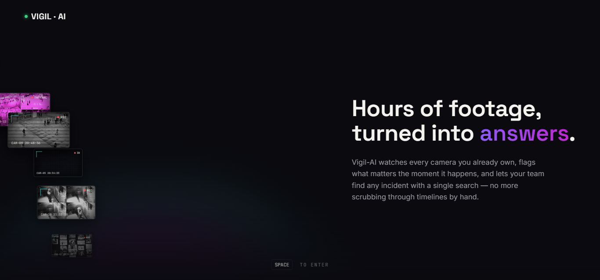
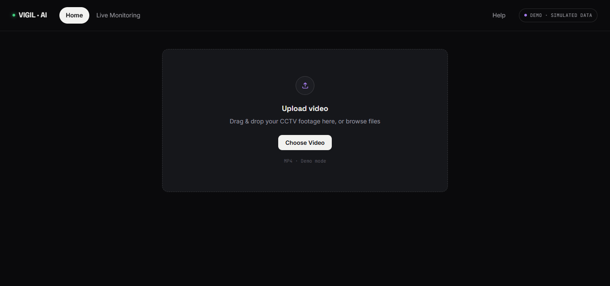
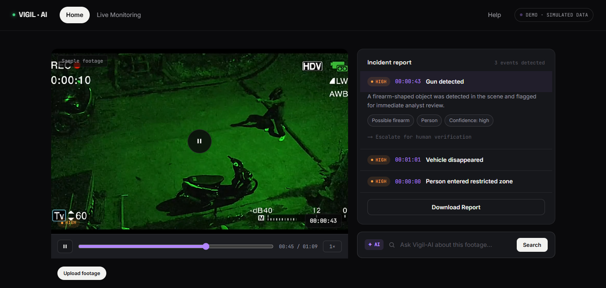
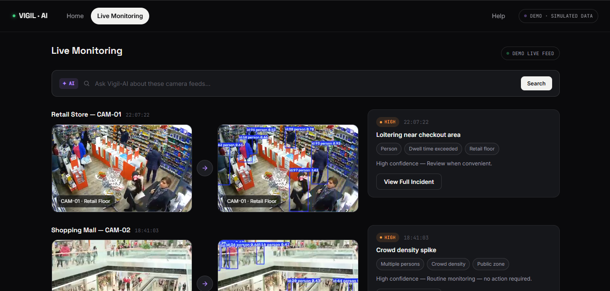
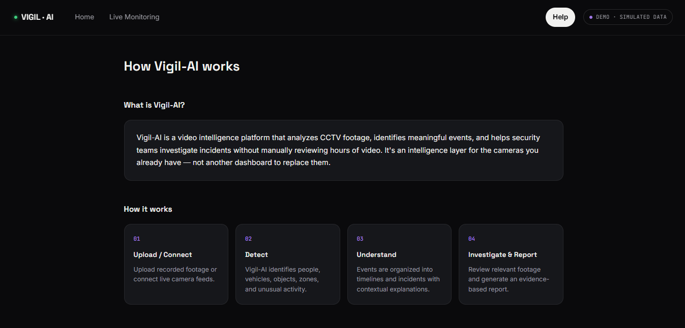

# ◉ VIGIL-AI

### `VIDEO  →  INTELLIGENCE  →  ACTION`

> **Hours of footage, turned into answers.**

<p align="center">

**🚀 [LIVE DEMO](https://vigil-ai-demo-frontend.vercel.app/)**  
**◈ [GITHUB REPOSITORY](https://github.com/pranjalraj54-hash/Vigil-AI-Frontend)**

</p>

---

## ◈ What is VIGIL-AI?

**VIGIL-AI** is a video intelligence platform concept that turns CCTV footage into structured, searchable incident information.

Instead of manually scrubbing through hours of footage, the platform is designed around:

```text
        CCTV / VIDEO
             │
             ▼
   ┌───────────────────┐
   │   ◉ AI ANALYSIS   │
   │                   │
   │  Detection        │
   │  Tracking         │
   │  Recognition      │
   │  Activity Analysis│
   └─────────┬─────────┘
             │
             ▼
   ┌───────────────────┐
   │  ◈ EVENT DATA     │
   │                   │
   │  People / Objects │
   │  Events / Context │
   │  Timelines        │
   └─────────┬─────────┘
             │
             ▼
   ┌───────────────────┐
   │  ◆ INVESTIGATION  │
   │                   │
   │  Search           │
   │  Review           │
   │  Reports          │
   └─────────┬─────────┘
             │
             ▼
       FASTER INSIGHT
```

---

## ✦ Demo Experience

```text
┌──────────────┐
│  01  UPLOAD  │
└──────┬───────┘
       ▼
┌──────────────┐
│  02  DETECT  │
└──────┬───────┘
       ▼
┌──────────────┐
│ 03 UNDERSTAND│
└──────┬───────┘
       ▼
┌──────────────┐
│ 04 INVESTIGATE│
└──────┬───────┘
       ▼
┌──────────────┐
│  05  REPORT   │
└──────────────┘
```

### ◉ Current Prototype

- ◈ CCTV footage upload interface
- ◈ Simulated event detection
- ◈ Incident timelines
- ◈ Incident report interface
- ◈ Live monitoring interface
- ◈ Natural-language search UI
- ◈ Multi-camera monitoring views
- ◈ Product / workflow explanation page

> **⚠️ DEMO MODE:** This repository is a **frontend demonstration**. It uses **simulated data and sample/simulated surveillance footage**. The current demo is not connected to real CCTV infrastructure and is intended to demonstrate the product concept and user experience.

---

# ⌁ Screenshots

### ◉ Landing Page

<p align="center">
  
</p>

### ◈ Upload Footage

<p align="center">
  
</p>

### ◆ Incident Analysis & Report

<p align="center">
  
</p>

### ◉ Live Monitoring

<p align="center">
  
</p>

### ? Product Overview

<p align="center">
  
</p>

---

# ⟡ System Flow

```text
                 ┌──────────────────┐
                 │   CCTV / VIDEO   │
                 └────────┬─────────┘
                          │
                          ▼
                 ┌──────────────────┐
                 │   AI ANALYSIS    │
                 │  ◉ Perception    │
                 │  ◉ Tracking      │
                 │  ◉ Classification│
                 └────────┬─────────┘
                          │
                          ▼
              ┌────────────────────────┐
              │     EVENT DETECTION    │
              │  People • Objects •     │
              │  Activity • Context    │
              └───────────┬────────────┘
                          │
                          ▼
              ┌────────────────────────┐
              │  SEARCH + TIMELINES    │
              │  Find • Filter • Review │
              └───────────┬────────────┘
                          │
                          ▼
              ┌────────────────────────┐
              │    INCIDENT REPORTS    │
              │   Evidence → Insight   │
              └───────────┬────────────┘
                          │
                          ▼
                   ◆ INVESTIGATE
                     FASTER
```

---

# ⚙ Tech Stack — Concept

```text
                         ◉ VIGIL-AI
                              │
            ┌─────────────────┼─────────────────┐
            │                 │                 │
            ▼                 ▼                 ▼
      ◈ FRONTEND       ◈ COMPUTER VISION   ◈ DEEP LEARNING
            │                 │                 │
        ◆ HTML             ◆ OpenCV          ◆ PyTorch
        ◆ CSS              ◆ YOLOv8          ◆ RNN / LSTM
        ◆ JavaScript       ◆ DeepSORT
            │                 │                 │
            └─────────────────┼─────────────────┘
                              │
                 ┌────────────┴────────────┐
                 ▼                         ▼
          ◈ SEARCH + GENAI          ◈ BACKEND + STORAGE
                 │                         │
             ◆ FAISS                    ◆ Python
             ◆ RAG                      ◆ Flask
             ◆ LLM                      ◆ MongoDB
                 │                         │
                 └────────────┬────────────┘
                              ▼
                       ◈ DEVOPS + INFRA
                              │
                       ◆ Docker
                       ◆ Git
                       ◆ GitHub
```

> **Note:** The stack above represents the broader VIGIL-AI system concept. This repository is currently focused on the **frontend demo / prototype experience**.

---

# ◈ Product Vision

```text
 OBSERVE
    │
    ▼
 UNDERSTAND
    │
    ▼
  SEARCH
    │
    ▼
INVESTIGATE
    │
    ▼
   ACT
```

**Same cameras.  
A smarter way to understand them.**

---

## ⌂ Run Locally

```bash
git clone https://github.com/pranjalraj54-hash/Vigil-AI-Frontend.git
cd Vigil-AI-Frontend
python -m http.server 5500
```

Then open:

```text
http://localhost:5500
```

Or simply explore the deployed demo:

**→ https://vigil-ai-demo-frontend.vercel.app/**

---

## ◈ Project Structure

```text
Vigil-AI-Frontend/
│
├── assets/
├── output/
├── reports/
│
├── index.html
├── home.html
├── live-monitoring.html
├── live-monitoring-option-2.html
├── incident-report.html
├── help.html
└── redesign-preview.html
```

---

# ⚠ Prototype Disclaimer

This project is a **demo/prototype** built to showcase the VIGIL-AI product concept and interface.

- Data shown in the interface is simulated.
- Footage shown in the demo is sample/simulated footage.
- The frontend is not connected to real CCTV infrastructure.
- Detection results are presented for demonstration purposes.
- This prototype should not be treated as a production security, law-enforcement, or emergency-response system.

---

## 👥 Team

| | Name | Role |
|---|---|---|
| ◉ | **Rudransh Tripathi** | Founder |
| ◉ | **Pranjal Raj** | Co-Founder |

---

<p align="center">

### `◉ VIGIL-AI`

**VIDEO → INTELLIGENCE → ACTION**

<sub>From hours of footage to minutes of insight.</sub>

</p>
